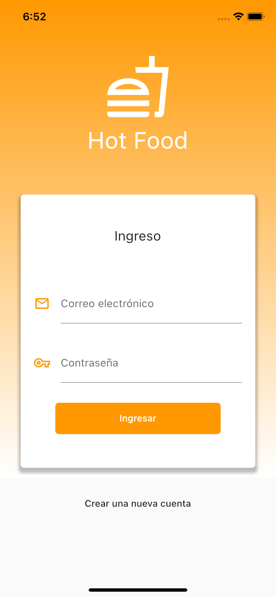
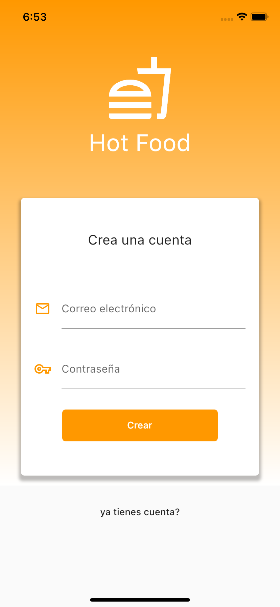
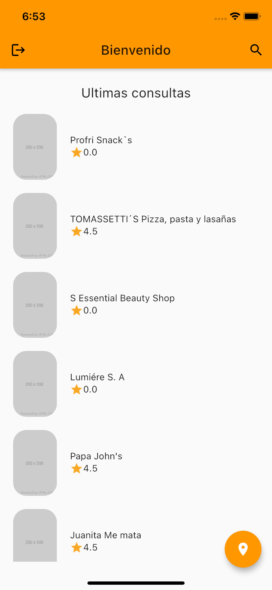
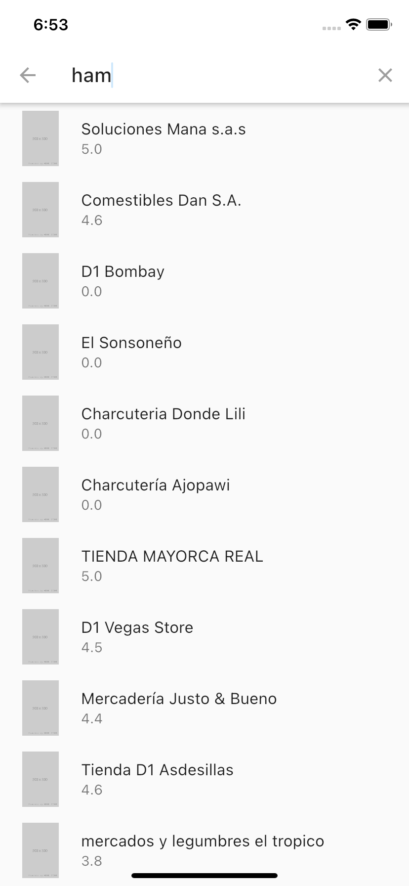
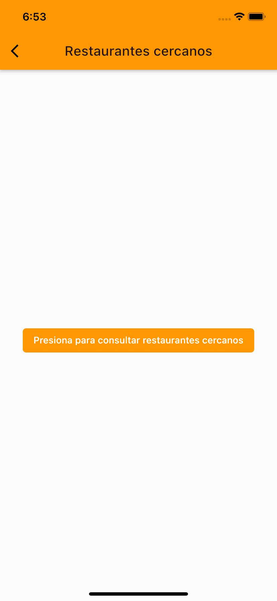
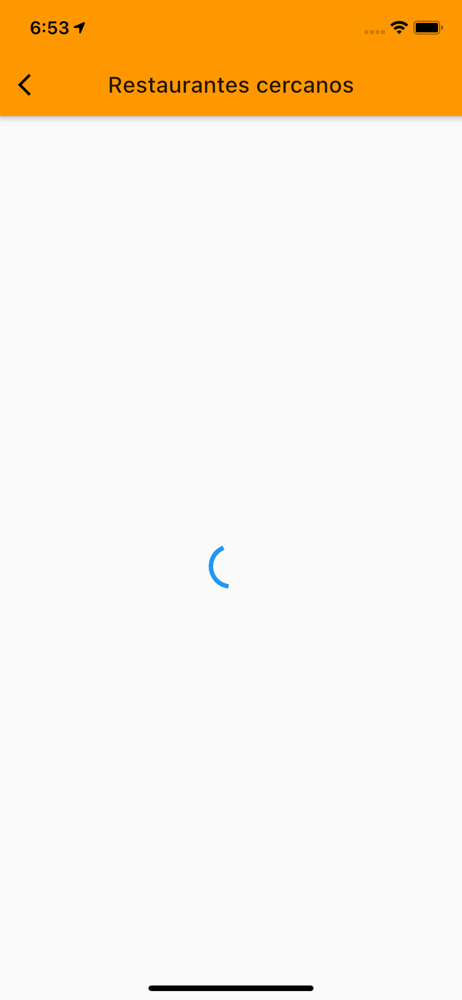
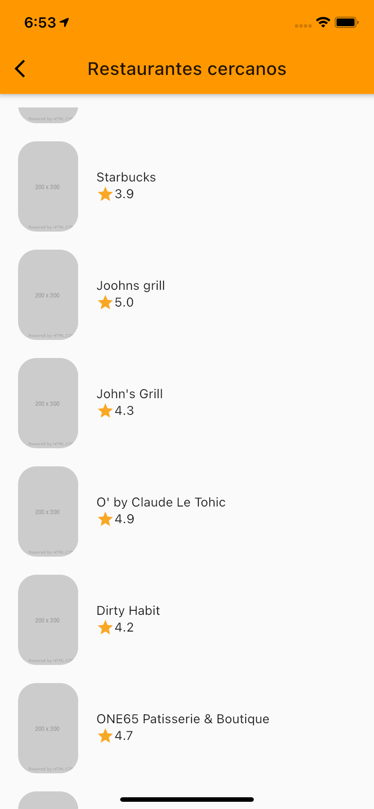

# tyba_test_daniel

Hot Food es una aplicación que permite registro e inicio de sesión. Consultar una lista de restaurantes por el texto del campo, obtiene los restaurantes cercano con la geolocalizacion del dispositivo. Ademas guarda y consulta los restaurantes previamente consultados.

## Screenshots

    
    
    
    
    
    
    

## Para iniciar el proyecto.

Este proyecto es un punto de partida para una aplicación Flutter.

Algunos recursos para comenzar si este es su primer proyecto de Flutter

- [Lab: Write your first Flutter app](https://flutter.dev/docs/get-started/codelab)

- [Cookbook: Useful Flutter samples](https://flutter.dev/docs/cookbook)
